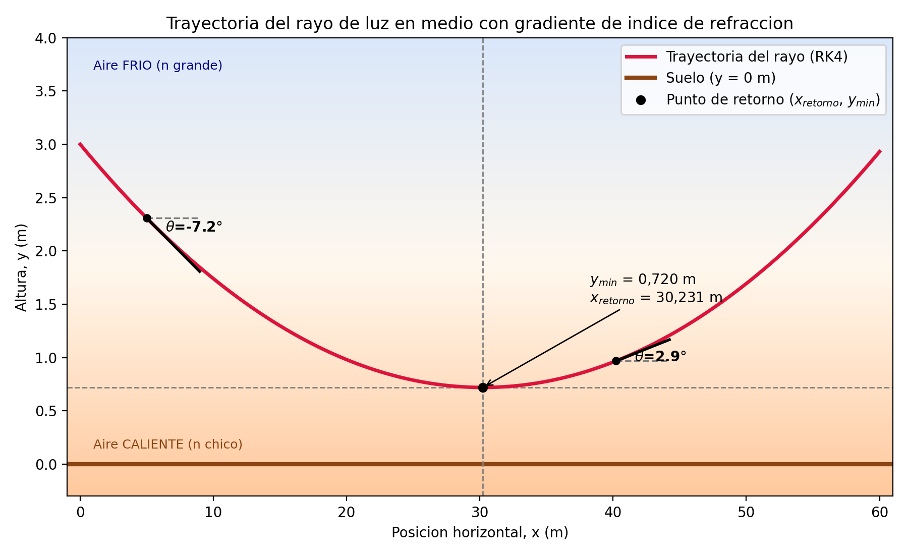
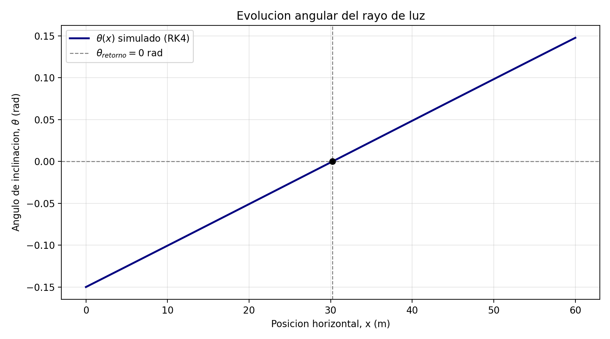

# Física para Ciencias de la Computación — DDD Parte 1

## Espejismos y Refracción de la Luz

> Esta es la parte de **código y simulación** del trabajo, documentada en este
> repositorio para que se pueda revisar directamente en GitHub. El informe
> oficial en Word (plantilla del profesor, con la tabla de integrantes y el
> resto de las respuestas del equipo) lo entrega el grupo por separado.

**Responsable de esta parte (código y simulación):** [Yo :3 ]

---

## 1. Parámetros utilizados

### 1.1 Tabla de parámetros

| Parámetro | Valor utilizado | Rango permitido (guía) |
|---|---|---|
| Constante de variación (α) | 5,00×10⁻³ m⁻¹ | [1,00×10⁻³ ; 9,00×10⁻³] m⁻¹ |
| Ángulo de incidencia inicial (θ₀) | -0,150 rad | [-0,200 ; -0,100] rad |
| Índice de refracción en la base (n₀) | 1,00030 | [1,00025 ; 1,00045] |
| Condición inicial del rayo en x (x₀) | 0,00 m | fijo |
| Condición inicial del rayo en y (y₀) | 3,00 m | [1,00 ; 5,00] m |
| Condición final del rayo en x (xf) | 60,0 m | [40,0 ; 90,0] m |
| Tamaño de paso (Δx) | 5,00×10⁻³ m | [1,00×10⁻³ ; 9,00×10⁻³] m |

### 1.2 Verificación de existencia del espejismo

Se debe cumplir la condición:

```
α > [n0 · (1 − cos θ0)] / [y0 · cos θ0]
```

Reemplazando los valores utilizados:

```
α_minimo = [1,00030 · (1 − cos(−0,150))] / [3,00 · cos(−0,150)]
α_minimo = [1,00030 · (1 − 0,988771)] / [3,00 · 0,988771]
α_minimo = 3,786617×10⁻³ m⁻¹
```

Como **α utilizado (5,00×10⁻³ m⁻¹) > α_minimo (3,786617×10⁻³ m⁻¹)**, la
condición se cumple y queda garantizada la existencia del espejismo (el rayo
alcanza una altura mínima y se redirige hacia arriba antes de tocar el suelo).

---

## 2. Resultados

### 2.1 Gráfica y vs x



El fondo de color representa el gradiente térmico del aire (naranja: aire
caliente cerca del suelo, índice de refracción menor; celeste: aire frío,
índice de refracción mayor). Se indica el ángulo local de inclinación del
rayo en dos puntos de la trayectoria.

- **Altura más cercana del rayo de luz al suelo:** y_min = 0,7199 m
- **Posición x donde se da la altura más cercana al suelo:** x_retorno = 30,231 m

### 2.2 Gráfica θ vs x



Se observa un comportamiento prácticamente lineal de θ(x). Esto ocurre porque,
con los parámetros utilizados, el índice de refracción n(y) varía muy poco a
lo largo de toda la trayectoria (de 1,00030 a 1,01530, menos de un 2% de
cambio relativo). Por lo tanto, el término 1/n(y) de la ecuación dinámica es
casi constante, lo que hace que dθ/dx ≈ α/n0 sea aproximadamente constante y,
en consecuencia, θ(x) resulte una función casi lineal de x (análogo a una
aceleración constante en cinemática).

### 2.3 Cálculo teórico con la ecuación (v)

```
y_min = [(n0 + α·y0)·cos θ0 − n0] / α

Paso 1: n0 + α·y0 = 1,00030 + (5,00×10⁻³)(3,00) = 1,015300
Paso 2: cos θ0 = cos(−0,150) = 0,988771
Paso 3: (n0 + α·y0)·cos θ0 = 1,015300 × 0,988771 = 1,003899
Paso 4: y_min = (1,003899 − 1,00030) / 5,00×10⁻³ = 0,7199 m

y_min (teórico) = 0,7199 m
```

### 2.4 Comparación y porcentaje de error

| Resultado | Valor |
|---|---|
| y_min (simulado, RK4 — sección 2.1) | 0,7199 m |
| y_min (teórico, Ecuación v — sección 2.3) | 0,7199 m |
| **Porcentaje de error** | **0,000 %** |

```
error (%) = |y_min,sim − y_min,teo| / y_min,teo × 100 = 0,000 %
```

El error es prácticamente nulo, lo que confirma que la simulación numérica
con RK4 reproduce correctamente el modelo físico planteado en la guía.

---

## 3. Código de la simulación realizada

**Plataforma utilizada:** Python

**Notebook completo (con animación interactiva incluida):**
[`DD2_Espejo.ipynb`](./DD2_Espejo.ipynb) · [`animacion.ipynb`](./animacion.ipynb)

```python
import numpy as np
import matplotlib.pyplot as plt
from matplotlib.colors import LinearSegmentedColormap

# ------------------------------------------------------------
# 1. PARAMETROS DE LA SIMULACION
# ------------------------------------------------------------
n0     = 1.00030
alpha  = 5.00e-3
theta0 = -0.150
x0     = 0.00
y0     = 3.00
xf     = 60.0
h      = 5.00e-3

# ------------------------------------------------------------
# 2. VERIFICACION DE EXISTENCIA DEL ESPEJISMO
# ------------------------------------------------------------
alpha_minimo = n0 * (1 - np.cos(theta0)) / (y0 * np.cos(theta0))
if alpha <= alpha_minimo:
    raise ValueError("alpha no garantiza el espejismo.")

# ------------------------------------------------------------
# 3. MODELO FISICO
# ------------------------------------------------------------
def n_de_y(y):
    """Indice de refraccion: n(y) = n0 + alpha*y"""
    return n0 + alpha * y

def dn_dy(y):
    """Derivada de n respecto a y (constante, ya que n(y) es lineal)"""
    return alpha

def F(x, u):
    """Lado derecho del sistema de EDOs: [dy/dx, dtheta/dx]"""
    y, theta = u
    return np.array([np.tan(theta), (1.0 / n_de_y(y)) * dn_dy(y)])

def paso_rk4(x, u, h):
    """Un paso del metodo de Runge-Kutta de 4to orden"""
    k1 = F(x, u)
    k2 = F(x + h/2, u + (h/2)*k1)
    k3 = F(x + h/2, u + (h/2)*k2)
    k4 = F(x + h, u + h*k3)
    return u + (h/6.0) * (k1 + 2*k2 + 2*k3 + k4)

# ------------------------------------------------------------
# 4. INTEGRACION NUMERICA (RK4)
# ------------------------------------------------------------
n_pasos = int(np.ceil((xf - x0) / h))
x_vals = np.zeros(n_pasos + 1)
y_vals = np.zeros(n_pasos + 1)
theta_vals = np.zeros(n_pasos + 1)
x_vals[0], y_vals[0], theta_vals[0] = x0, y0, theta0

u = np.array([y0, theta0])
x = x0
for i in range(n_pasos):
    u = paso_rk4(x, u, h)
    x += h
    x_vals[i+1], y_vals[i+1], theta_vals[i+1] = x, u[0], u[1]
    if u[0] <= 0:
        break

# ------------------------------------------------------------
# 5. PUNTO DE RETORNO (interpolacion lineal donde theta = 0)
# ------------------------------------------------------------
for k in range(len(theta_vals) - 1):
    if theta_vals[k] <= 0 and theta_vals[k+1] > 0:
        frac = -theta_vals[k] / (theta_vals[k+1] - theta_vals[k])
        x_retorno = x_vals[k] + frac * (x_vals[k+1] - x_vals[k])
        y_min_sim = y_vals[k] + frac * (y_vals[k+1] - y_vals[k])
        break

# ------------------------------------------------------------
# 6. y_min TEORICO Y ERROR PORCENTUAL
# ------------------------------------------------------------
y_min_teo = ((n0 + alpha*y0) * np.cos(theta0) - n0) / alpha
error_porcentual = abs(y_min_sim - y_min_teo) / y_min_teo * 100

print(f"x_retorno = {x_retorno:.3f} m")
print(f"y_min simulado = {y_min_sim:.4f} m")
print(f"y_min teorico  = {y_min_teo:.4f} m")
print(f"Error = {error_porcentual:.3f} %")

# ------------------------------------------------------------
# 7. GRAFICA y vs x (fondo termico + angulo local marcado)
# ------------------------------------------------------------
fig1, ax1 = plt.subplots(figsize=(9, 5.5))
y_min_plot = min(-0.3, y_vals.min() - 0.3)
y_max_plot = y0 + 1.0

cmap_aire = LinearSegmentedColormap.from_list(
    "aire", ["#ff9d4d", "#fff3e0", "#bcd4f7"]
)
gradiente = np.linspace(0, 1, 256).reshape(-1, 1)
ax1.imshow(gradiente, extent=[x_vals.min()-1, x_vals.max()+1, y_min_plot, y_max_plot],
           origin="lower", aspect="auto", cmap=cmap_aire, alpha=0.55, zorder=0)
ax1.text(1, 0.15, "Aire CALIENTE (n chico)", fontsize=9, color="saddlebrown")
ax1.text(1, y_max_plot-0.3, "Aire FRIO (n grande)", fontsize=9, color="navy")

ax1.plot(x_vals, y_vals, color="crimson", linewidth=2.5, zorder=3,
         label="Trayectoria del rayo (RK4)")
ax1.axhline(0, color="saddlebrown", linewidth=3, zorder=2, label="Suelo (y = 0 m)")
ax1.axhline(y_min_sim, color="gray", linestyle="--", linewidth=1, zorder=2)
ax1.axvline(x_retorno, color="gray", linestyle="--", linewidth=1, zorder=2)
ax1.plot(x_retorno, y_min_sim, "o", color="black", zorder=5,
          label=r"Punto de retorno ($x_{retorno}$, $y_{min}$)")

def dibujar_angulo(ax, x_arr, y_arr, theta_arr, x_objetivo, largo=4, color="black"):
    """Dibuja la referencia horizontal (0 grados) y la direccion real del
    rayo en el punto mas cercano a x_objetivo, con la etiqueta theta=..°
    ubicada en la bisectriz, justo en el vertice entre ambas rectas."""
    idx = np.argmin(np.abs(x_arr - x_objetivo))
    xp, yp, th = x_arr[idx], y_arr[idx], theta_arr[idx]
    ax.plot([xp, xp+largo], [yp, yp], "--", color="gray", linewidth=1.2, zorder=4)
    ax.plot([xp, xp+largo*np.cos(th)], [yp, yp+largo*np.sin(th)],
            color=color, linewidth=2, zorder=5)
    ax.plot(xp, yp, "o", color=color, markersize=5, zorder=6)
    r_etiqueta = largo * 0.35
    angulo_bisectriz = th / 2
    x_txt = xp + r_etiqueta*np.cos(angulo_bisectriz)
    y_txt = yp + r_etiqueta*np.sin(angulo_bisectriz)
    ax.annotate(rf"$\theta$={np.degrees(th):.1f}$\degree$", xy=(x_txt, y_txt),
                fontsize=9, fontweight="bold", ha="left", va="center", zorder=7)

dibujar_angulo(ax1, x_vals, y_vals, theta_vals, x_objetivo=x_vals.min()+5)
dibujar_angulo(ax1, x_vals, y_vals, theta_vals, x_objetivo=x_retorno+10)

ax1.annotate(
    f"y_min = {y_min_sim:.3f} m\nx_retorno = {x_retorno:.3f} m",
    xy=(x_retorno, y_min_sim), xytext=(x_retorno + 8, y_min_sim + 0.8),
    arrowprops=dict(arrowstyle="->", color="black"), fontsize=10)

ax1.set_title("Trayectoria del rayo de luz en medio con gradiente de indice de refraccion")
ax1.set_xlabel("Posicion horizontal, x (m)")
ax1.set_ylabel("Altura, y (m)")
ax1.legend(loc="upper right")
ax1.set_xlim(x_vals.min()-1, x_vals.max()+1)
ax1.set_ylim(y_min_plot, y_max_plot)
fig1.tight_layout()
fig1.savefig("grafica_y_vs_x.png", dpi=200)

# ------------------------------------------------------------
# 8. GRAFICA theta vs x
# ------------------------------------------------------------
fig2, ax2 = plt.subplots(figsize=(9, 5))
ax2.plot(x_vals, theta_vals, color="navy", linewidth=2,
         label=r"$\theta(x)$ simulado (RK4)")
ax2.axhline(0, color="gray", linestyle="--", linewidth=1,
            label=r"$\theta_{retorno} = 0$ rad")
ax2.axvline(x_retorno, color="gray", linestyle="--", linewidth=1)
ax2.plot(x_retorno, 0, "o", color="black", zorder=5)
ax2.set_title("Evolucion angular del rayo de luz")
ax2.set_xlabel("Posicion horizontal, x (m)")
ax2.set_ylabel(r"Angulo de inclinacion, $\theta$ (rad)")
ax2.legend(loc="upper left")
ax2.grid(alpha=0.3)
fig2.tight_layout()
fig2.savefig("grafica_theta_vs_x.png", dpi=200)
```

---

## Cómo ejecutar

```bash
pip install numpy matplotlib ipympl
```

1. Abrir `DD2_Espejo.ipynb` y ejecutar todas las celdas → genera las gráficas
   y `resultados_rk4.npz`.
2. Abrir `animacion.ipynb` y ejecutar todas las celdas para la visualización
   interactiva con slider (requiere `%matplotlib widget`).

## Referencias

- Chapra, S., & Canale, R. (2015). *Métodos numéricos para ingenieros* (7ma ed.). McGraw-Hill Education.
- Sears, F. W., Zemansky, M. W., Young, H. D., & Freedman, R. A. (2018). *Física universitaria* (14a ed., Vol. 2). Pearson Educación.
- Serway, R. A., & Jewett, J. W. (2019). *Física para ciencias e ingeniería* (10a ed., Vol. 2). Cengage Learning.